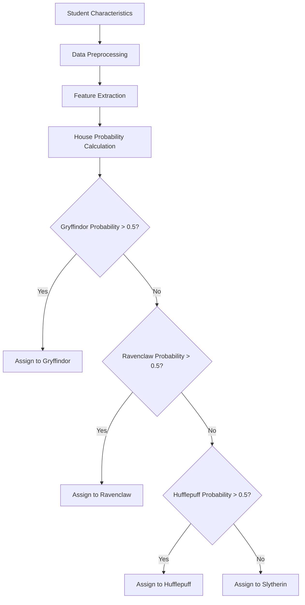

# Hogwarts House Prediction: The Sorting Hat Algorithm 🧙♂️✨

[](https://42firenze.it/)
[](https://github.com/Nazar963/42_dslr/blob/master/LICENSE)
[](https://python.org)
[](https://pandas.pydata.org)
[](https://github.com/Nazar963/42_dslr)

A magical data science project implementing multinomial logistic regression to predict Hogwarts houses (Gryffindor, Hufflepuff, Ravenclaw, Slytherin) based on student characteristics, replicating the Sorting Hat's decision-making process.

## Table of Contents 📖
- [Project Overview](#project-overview)
- [Features](#features)
- [Mathematical Approach](#mathematical-approach)
- [Installation](#installation)
- [Usage](#usage)
- [Dataset](#dataset)
- [Implementation Details](#implementation-details)
- [Results](#results)
- [Dependencies](#dependencies)
- [Learning Resources](#learning-resources)
- [License](#license)

## Project Overview

The DSLR (Data Science Logistic Regression) project is a 42 School assignment focused on creating a magical Sorting Hat algorithm that predicts which Hogwarts house a student belongs to based on their characteristics. The project implements multinomial logistic regression from scratch using Python.

**Key Objectives**:
- Load and preprocess magical dataset
- Handle missing values in magical measurements
- Implement one-vs-all logistic regression
- Train classification models for each house
- Evaluate model performance
- Visualize feature importance and decision boundaries

**Project Constraints**:
- Implemented without machine learning libraries (scikit-learn)
- Pure Python with Numpy only (no Pandas for core functionality)
- Handles missing values with np.nan_to_num()
- Uses only 4 specific features: Arithmancy, Astronomy, Defense Against Dark Arts, Ancient Runes
- Includes data visualization scripts for exploratory analysis

## Features

### Core Functionality
- **Data Loading**: CSV parsing using numpy.genfromtxt()
- **Data Cleaning**: Handling missing values with np.nan_to_num()
- **Feature Selection**: Uses 4 key features from 13 available
- **Feature Scaling**: Custom StandardScaler implementation
- **Multiclass Classification**: One-vs-all logistic regression
- **Gradient Descent**: Custom implementation with regularization
- **Model Persistence**: Save/load trained models as .npy files
- **Data Visualization**: Histogram, scatter plots, and pair plots

### Sorting Process


## Mathematical Approach

### Logistic Regression (Sigmoid Function)
$$h_\theta(x) = \frac{1}{1 + e^{-\theta^Tx}}$$

### Cost Function
$$J(\theta) = -\frac{1}{m} \sum_{i=1}^{m} [y^{(i)} \log(h_\theta(x^{(i)})) + (1 - y^{(i)}) \log(1 - h_\theta(x^{(i)}))]$$

### Gradient Descent Update
$$\theta_j := \theta_j - \alpha \frac{\partial J(\theta)}{\partial \theta_j}$$

### One-vs-All Strategy
- Train 4 separate classifiers:
  1. Gryffindor vs. Others
  2. Hufflepuff vs. Others
  3. Ravenclaw vs. Others
  4. Slytherin vs. Others
- Select house with highest probability

## Installation

### Requirements
- Python 3.9+
- pip

### Setup
```bash
# Clone repository
git clone https://github.com/Nazar963/42_dslr.git
cd 42_dslr

# Create virtual environment
python3 -m venv venv
source venv/bin/activate

# Install dependencies
pip install -r requirements.txt
```

## Usage

### Training the Sorting Hat
```bash
python logreg_train.py datasets/dataset_train.csv
```

### Predicting Houses
```bash
python logreg_predict.py datasets/dataset_test.csv
```

### Example Workflow
```python
# Train models using command line
# python logreg_train.py datasets/dataset_train.csv

# Make predictions using command line
# python logreg_predict.py datasets/dataset_test.csv

# For programmatic use:
from describe import get_data
from logreg_train import SelfMadeStandardScaler
from logreg_predict import load_models, predict
import numpy as np
import pickle

# Load and preprocess test data
data = get_data('datasets/dataset_test.csv')[0][:, [1, 8, 9, 17, 18]]
data = np.where(data == '', np.nan, data)
X = np.nan_to_num(data[:, 1:].astype(float))

# Load trained models
houses = ['Gryffindor', 'Hufflepuff', 'Ravenclaw', 'Slytherin']
weights, biases = load_models(houses)
with open('scaler.pkl', 'rb') as f:
    scaler = pickle.load(f)

# Predict houses
predicted_houses, probabilities = predict(X, weights, biases, scaler)
print(f"First 5 predictions: {predicted_houses[:5]}")
```

## Dataset

The dataset contains magical metrics for Hogwarts students. **Note**: The current implementation uses only 4 key features out of 13 available:

| Feature Used | Column Index | Description | Magical Discipline |
|--------------|--------------|-------------|--------------------|
| ✅ Arithmancy | 6 | Number magic | Arithmancy |
| ✅ Astronomy | 7 | Celestial studies | Astronomy |
| ✅ Defense Against Dark Arts | 9 | Dark magic defense | Defense |
| ✅ Ancient Runes | 12 | Ancient languages | Ancient Runes |

**Available but unused features**:
| Feature | Description | Magical Discipline |
|---------|-------------|--------------------|
| Herbology | Plant magic | Herbology |
| Divination | Future seeing | Divination |
| Muggle Studies | Non-magical culture | Muggle Studies |
| History of Magic | Magical history | History |
| Transfiguration | Object transformation | Transfiguration |
| Potions | Magical brewing | Potions |
| Care of Magical Creatures | Creature handling | Creature Care |
| Charms | Spellcasting | Charms |
| Flying | Broomstick flying | Flying |

**Sample Data Structure**:
```csv
Index,Hogwarts House,First Name,Last Name,Birthday,Best Hand,Arithmancy,Astronomy,Herbology,Defense Against the Dark Arts,...
0,Ravenclaw,Tamara,Hsu,2000-03-30,Left,58384.0,-487.89,5.73,4.88,...
1,Slytherin,Erich,Paredes,1999-10-14,Right,67239.0,-552.06,-5.99,5.52,...
2,Ravenclaw,Stephany,Braun,1999-11-03,Left,23702.0,-366.08,7.73,3.66,...
```

**Data Processing**:
- Uses columns [1, 8, 9, 17, 18] which correspond to [House, Arithmancy, Astronomy, Defense Against Dark Arts, Ancient Runes]
- Missing values are replaced with 0 using `np.nan_to_num()`
- Features are standardized using custom `SelfMadeStandardScaler`

### House Distribution
*Note: Add your actual visualization by running the analysis scripts*

**Available Analysis Scripts**:
- `python describe.py` - Statistical description of features
- `python histogram.py` - Feature distribution by house
- `python scatter_plot.py` - Scatter plot analysis  
- `python pair_plot.py` - Pairwise feature relationships

## Implementation Details

### Key Components
1. **Data Loading Function**:
   ```python
   def get_data(filename):
       all_data = np.genfromtxt(filename, delimiter=",", dtype=str, encoding=None)
       main_data = np.genfromtxt(filename, delimiter=",", skip_header=1, dtype=str, encoding=None)
       header = np.genfromtxt(filename, delimiter=",", dtype=str, max_rows=1)
       # Process and clean data
       return all_data, desc_data, header
   ```

2. **Training Implementation**:
   ```python
   def train_model(X_train, y_train, house):
       n_features = X_train.shape[1]
       weights, bias = initialize_parameters(n_features)
       scaler = SelfMadeStandardScaler()
       X_train_scaled = scaler.fit_transform(X_train)
       y_train = (y_train == house).astype(int).reshape(-1, 1)
       
       for i in range(epochs):
           y_pred = forward_pass(X_train_scaled, weights, bias)
           loss = compute_loss(y_pred, y_train, weights)
           dw, db = gradient_descent(X_train_scaled, y_train, y_pred)
           weights, bias = update_parameters(weights, bias, dw, db, y_train.shape[0])
       
       return weights, bias, scaler
   ```

3. **Prediction Implementation**:
   ```python
   def predict(X, weights, biases, scaler):
       y_pred = np.zeros((X.shape[0], len(weights)), dtype=float)
       X_test_scaled = scaler.transform(X)
       
       for i, (weight, bias) in enumerate(zip(weights, biases)):
           for k in range(X_test_scaled.shape[0]):
               y_pred[k][i] = forward_pass(X_test_scaled[k], weight, bias)[0]
       
       max_index = np.argmax(y_pred, axis=1)
       houses = ['Gryffindor', 'Hufflepuff', 'Ravenclaw', 'Slytherin']
       predicted_houses = [houses[index] for index in max_index]
       return predicted_houses, max_index
   ```

## Results

### Model Architecture
- **Algorithm**: One-vs-All Logistic Regression
- **Features**: 4 numerical features (Arithmancy, Astronomy, Defense Against Dark Arts, Ancient Runes)
- **Training**: 2000 epochs with learning rate 0.01
- **Regularization**: L2 regularization with λ = 0.001
- **Scaling**: Z-score normalization

### Output
- **Training**: Saves 4 model files (one per house) + scaler in pickle format
- **Prediction**: Generates `houses.csv` with Index and predicted Hogwarts House
- **Model Files**: 
  - `models/Gryffindor_weights.npy`, `models/Gryffindor_bias.npy`
  - `models/Hufflepuff_weights.npy`, `models/Hufflepuff_bias.npy`
  - `models/Ravenclaw_weights.npy`, `models/Ravenclaw_bias.npy`
  - `models/Slytherin_weights.npy`, `models/Slytherin_bias.npy`
  - `scaler.pkl`

*Note: To get actual performance metrics, run your trained model on a labeled test set and add results here.*

## Dependencies

| Package | Version | Purpose |
|---------|---------|---------|
| numpy | Latest | Numerical operations and data processing |
| matplotlib | Latest | Data visualization (histograms, scatter plots) |
| seaborn | Latest | Statistical visualization (pair plots) |
| pandas | Latest | Data visualization support only |

## Learning Resources

1. [Logistic Regression Explained](https://towardsdatascience.com/logistic-regression-detailed-overview-46c4da4303bc)
2. [Multiclass Classification Strategies](https://scikit-learn.org/stable/modules/multiclass.html)
3. [Gradient Descent Visualization](https://www.desmos.com/calculator/njoe1fde0t)

## 🤝 Contributing
Feel free to submit issues or pull requests if you have suggestions for improving the application or adding more features.

## License
This project is licensed under the MIT License - see the [LICENSE](LICENSE) for details.

## 📧 Contact
For questions or feedback, please open an issue in the repository.

## ⭐ Star this repository if you found it helpful!
[](https://github.com/Nazar963/42_dslr/stargazers)

---

🧙 *"Turns out the Sorting Hat is just logistic regression with a British accent"*  
[](https://profile-v3.intra.42.fr/users/naal-jen)
[](https://github.com/Nazar963)
[](https://github.com/Nazar963)

---

## 🍀 Goodluck:
Good luck with your 42_dslr project at 42! 🚀